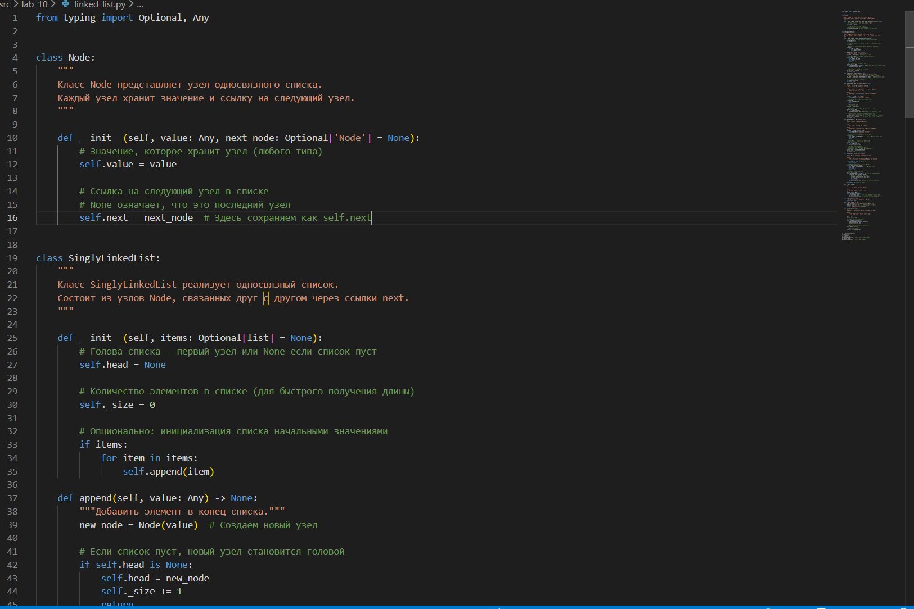
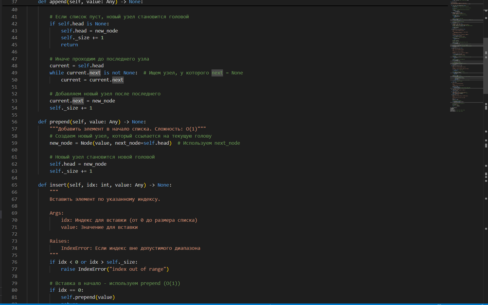
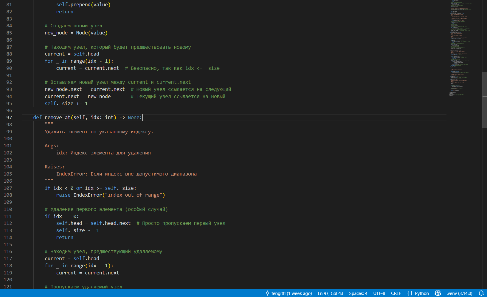
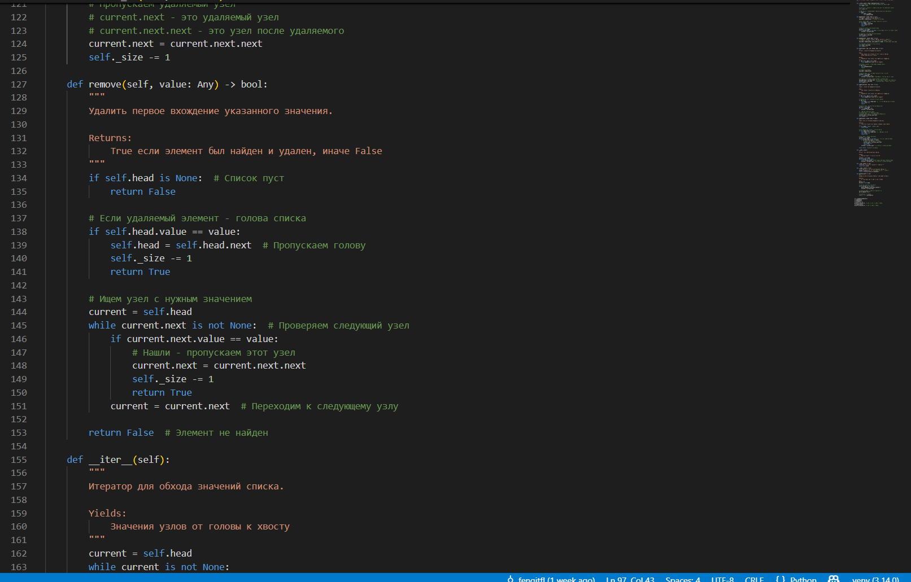
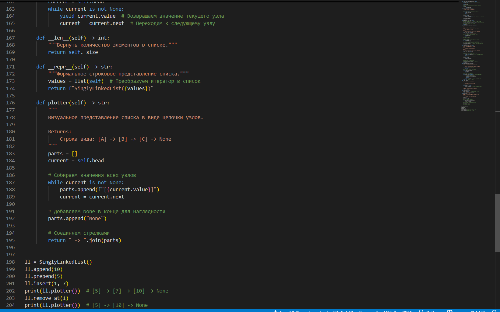
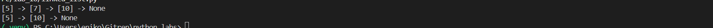
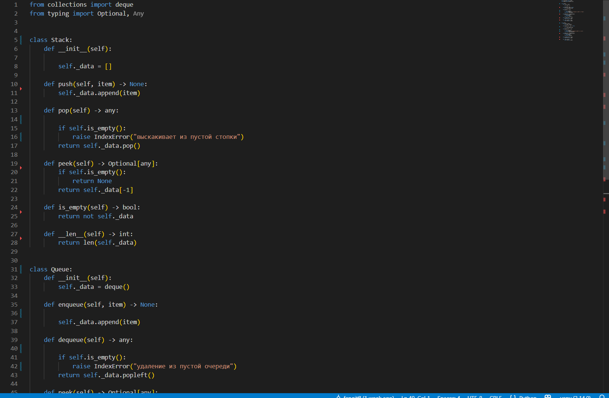
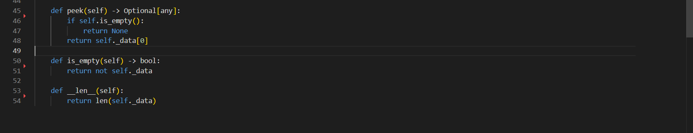
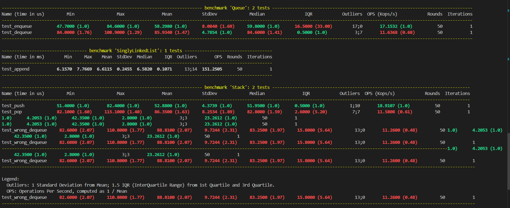

# Лабораторная работа 10: Структуры данных

## Теоретическая часть

### Стек (Stack)
**Стек** — структура данных, работающая по принципу LIFO (Last In, First Out — последним пришел, первым вышел). Аналогия: стопка тарелок — новую тарелку кладут сверху и сверху же берут.

**Основные операции:**
- `push(item)` — добавление элемента на вершину стека 
- `pop()` — удаление и возврат элемента с вершины
- `peek()` — просмотр вершины без удаления 
- `is_empty()` — проверка на пустоту 

### Очередь (Queue)
**Очередь** — структура данных, работающая по принципу FIFO (First In, First Out — первым пришел, первым вышел). Аналогия: очередь в магазине.

**Основные операции:**
- `enqueue(item)` — добавление в конец очереди 
- `dequeue()` — удаление и возврат из начала очереди 
- `peek()` — просмотр начала без удаления 
- `is_empty()` — проверка на пустоту 

### Связный список (Linked List)
**Односвязный список** — линейная структура данных, состоящая из узлов, каждый из которых содержит значение и ссылку на следующий узел.

**Преимущества:**
- Динамическое изменение размера
- Эффективная вставка/удаление в начале 

**Недостатки:**
- Доступ по индексу требует обхода 
- Дополнительная память на хранение ссылок

**Основные операции:**
- `append(value)` — добавление в конец 
- `prepend(value)` — добавление в начало 
- `insert(idx, value)` — вставка по индексу 
- `remove(value)` — удаление по значению 
- `remove_at(idx)` — удаление по индексу 

## Реализация Linked

## Вывод

## Реализация structures

## Бенчмарки

## Полная сортировка от самого быстрого к самому медленному:
### Stack.push: 52.88 µs (микросекунд) 
### Queue.enqueue: 58.30 µs
### WrongQueue.enqueue: 70.04 µs
### Queue.dequeue: 85.93 µs
### Stack.pop: 86.35 µs
### WrongQueue.dequeue: 88.81 µs
### SinglyLinkedList.append: 6.61 ms (миллисекунд) = 6610 µs 