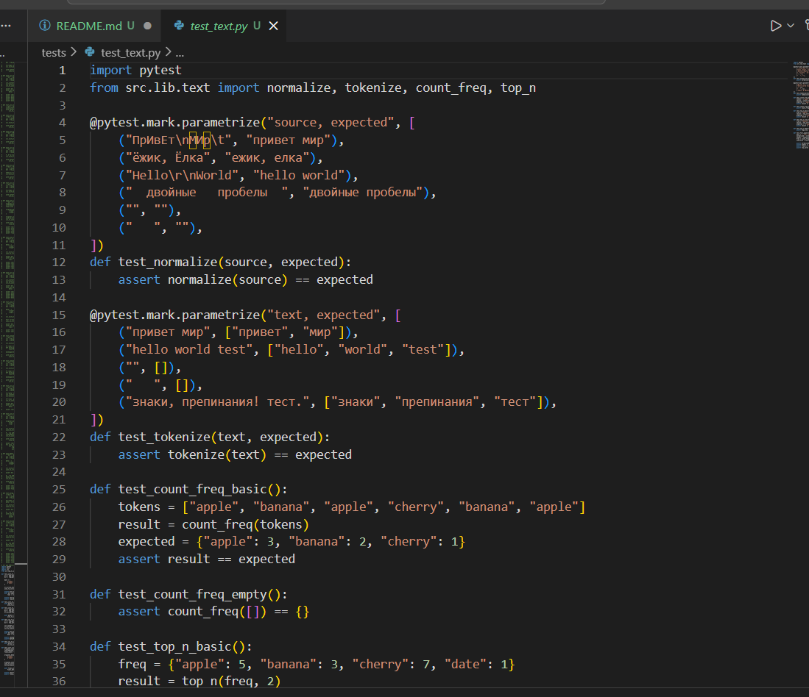
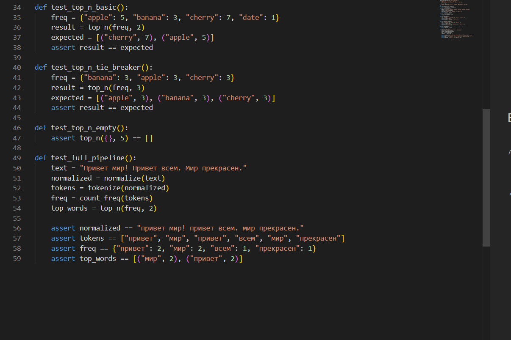
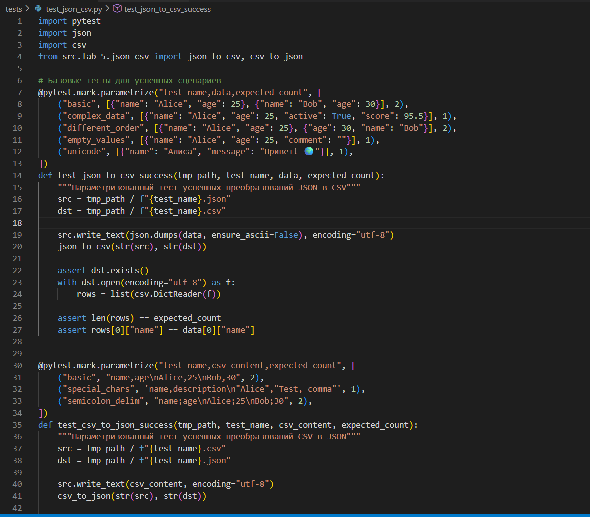
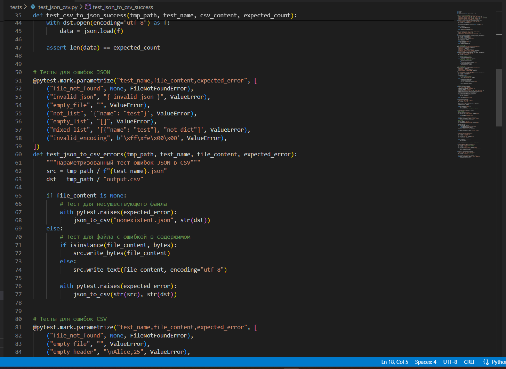
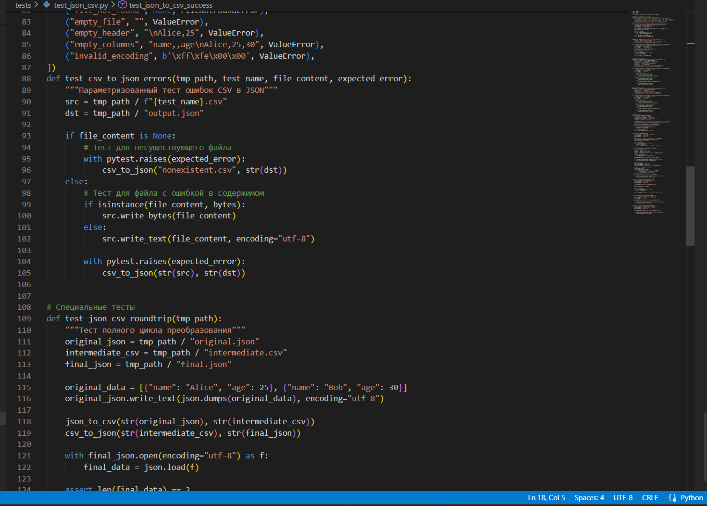
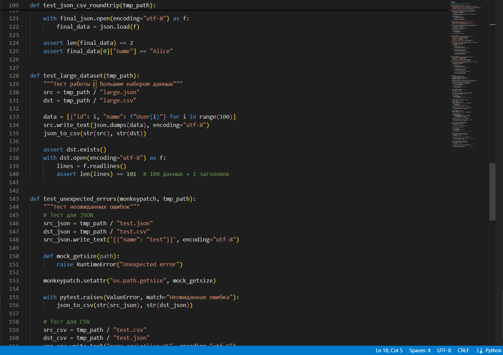
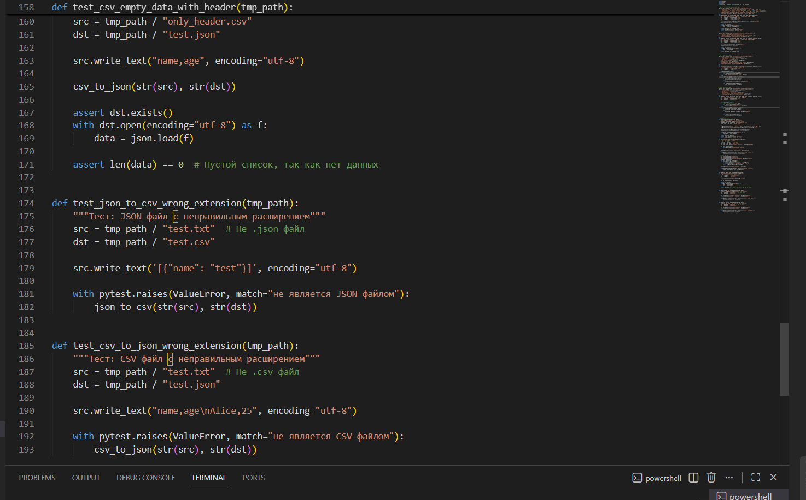

# Лабораторная работа №7
## A. Тесты для text.py
### Созданы комплексные тесты для всех функций модуля:
- ### `normalize()` - базовые и граничные случаи
- ### `tokenize()` - различные сценарии токенизации
- ### `count_freq()` - подсчет частот слов
- ### `top_n()` - извлечение топ-N элементов с обработкой одинаковых частот

## B. Тесты для json_csv.py
### Реализованы тесты для функций конвертации:
- ### Позитивные сценарии (корректная конвертация)
- ### Негативные сценарии (ошибки файлов, некорректные данные)
- ### Тесты полного цикла конвертации

## C. Стиль кода
### Проект отформатирован с помощью black согласно конфигурации.

## ★ Дополнительное задание
### Настроено измерение покрытия кода с помощью pytest-cov

## Результаты
- ### Покрытие кода: 100%
- ### Все тесты проходят успешно
- ### Код соответствует стилю black

