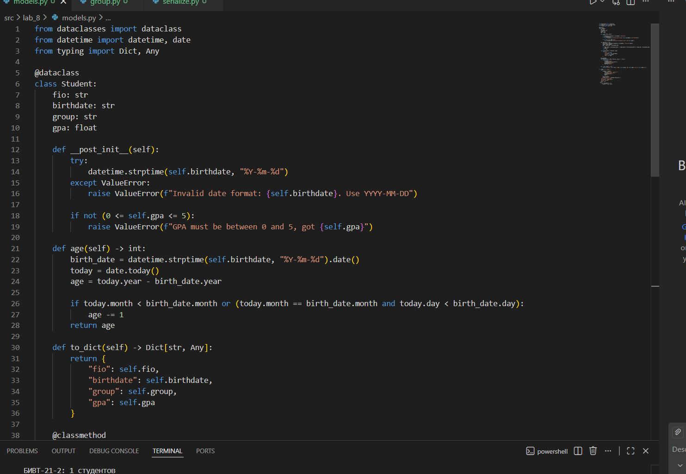
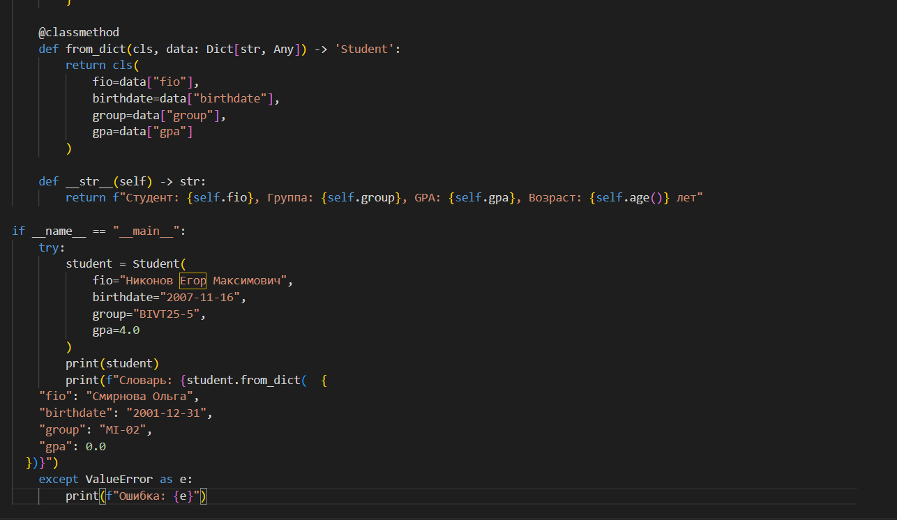
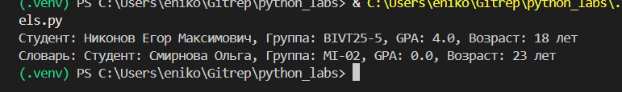
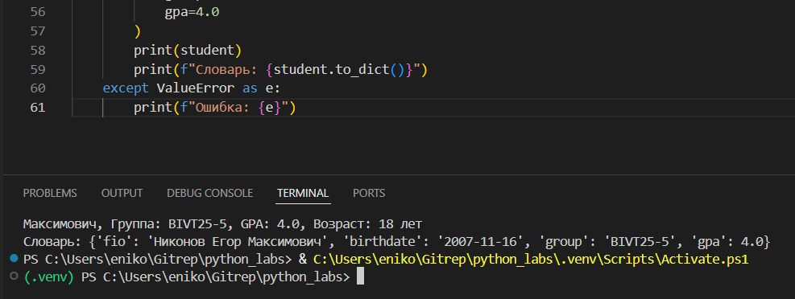
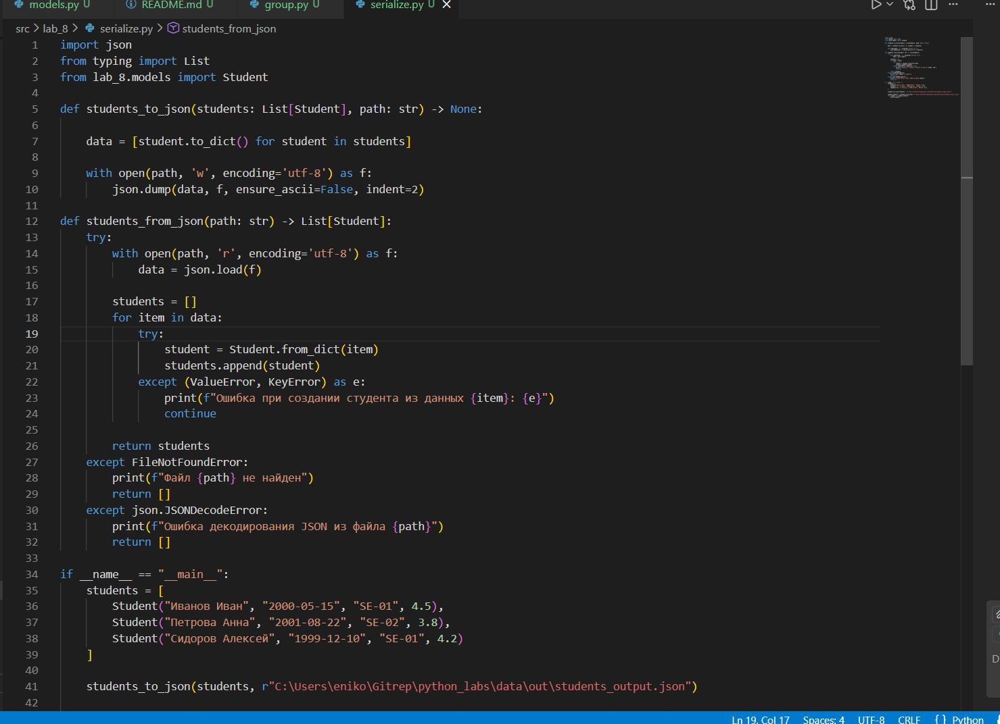
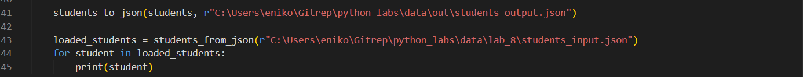
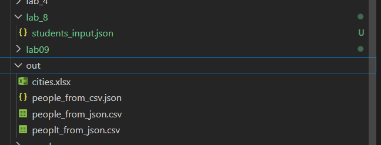
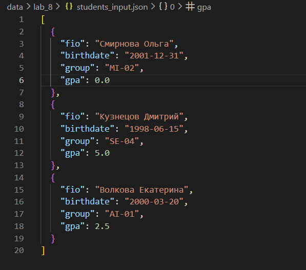
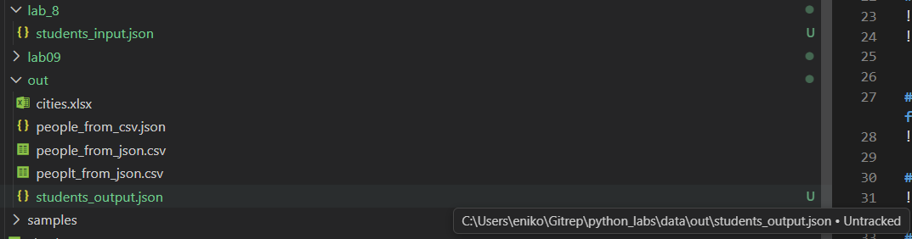
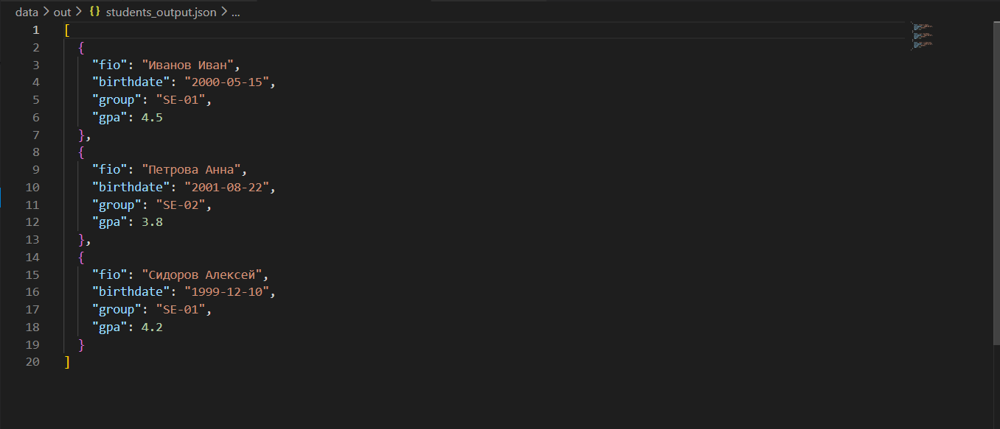

# Лабораторная №8
## Описание класса Student

Класс `Student` реализован с использованием декоратора `@dataclass` и содержит:

### Поля:
- `fio: str` - ФИО студента
- `birthdate: str` - Дата рождения в формате YYYY-MM-DD
- `group: str` - Группа обучения
- `gpa: float` - Средний балл (от 0 до 5)

### Методы:
- `__post_init__()` - валидация данных после инициализации
- `age()` - вычисление возраста студента
- `to_dict()` - сериализация в словарь
- `from_dict()` - десериализация из словаря
- `__str__()` - строковое представление объекта

### Валидация:
- Проверка формата даты (YYYY-MM-DD)
- Проверка диапазона GPA (0 ≤ gpa ≤ 5)
## Код models:

## Примеры вывода(просто print(student) и student.from_dict)

## student.to_dict

## Код serialise

## Примеры вывода(до -> после):

