# Лабораторная работа 9 

## Цель работы
Реализовать простое хранилище данных студентов на основе CSV-файла с использованием CRUD-операций.

## Реализованные возможности

### Класс Group
- **Инициализация**: `Group(storage_path)` - создает или открывает CSV-файл

- **Добавление**: `add(student)` - добавляет нового студента

- **Чтение**: `list()` - возвращает всех студентов

- **Поиск**: `find(substr)` - ищет студентов по подстроке в ФИО

- **Обновление**: `update(fio, **fields)` - обновляет данные студента

- **Удаление**: `remove(fio)` - удаляет студента по ФИО

- **Статистика**: `stats()` - собирает статистику по группе (дополнительное задание)

- **Вывод**: `print_stats()` - выводит статисктику по строкам(красивый вид)

## Код group 
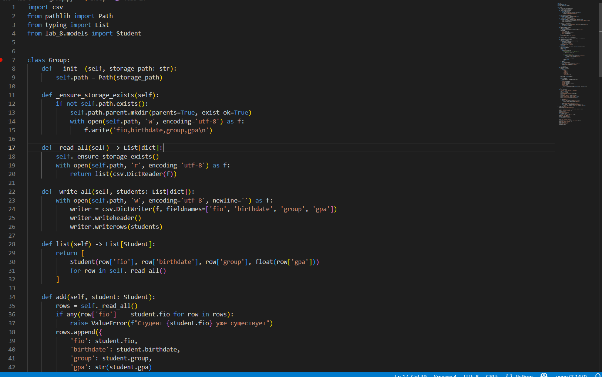
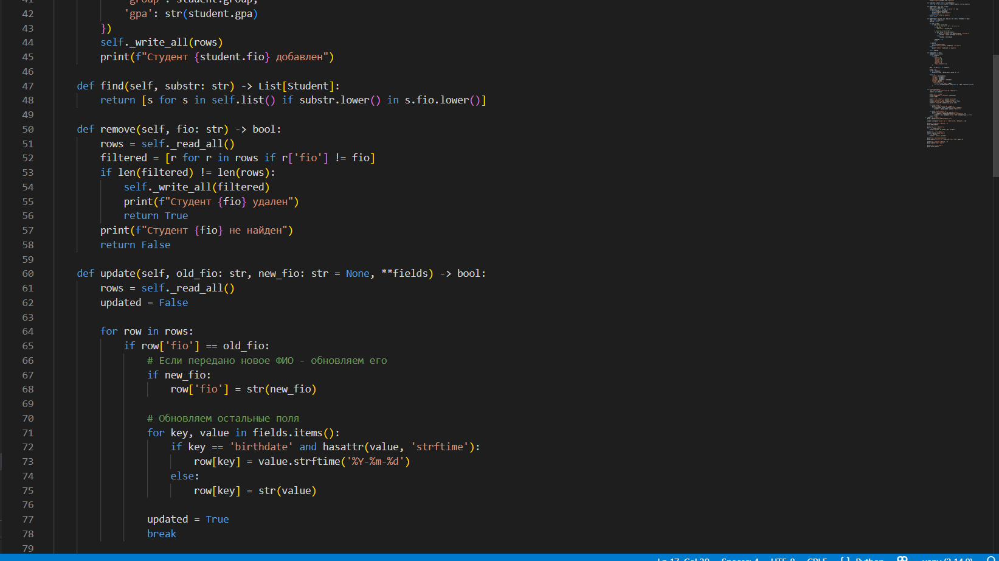
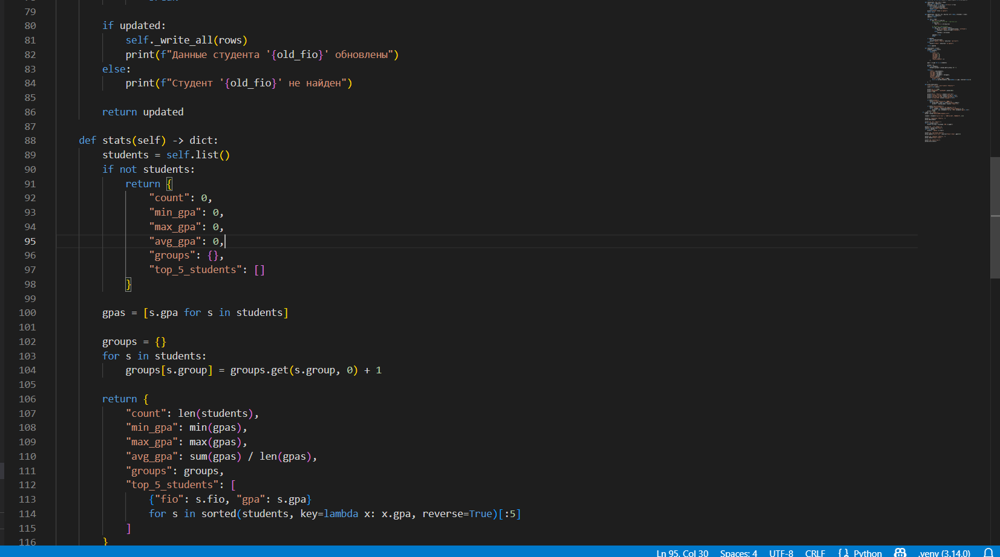
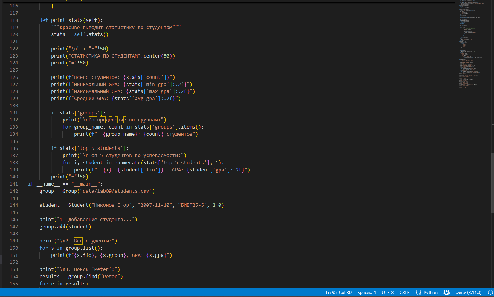
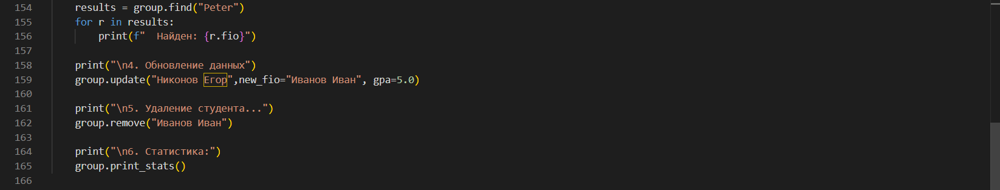

# Создание группы
group = Group("data/lab09/students.csv")

# Добавление студента
student = Student(fio="Никонов Егор",birthdate=date(2007, 11, 16),group="БИВТ25-5",gpa=2.0)
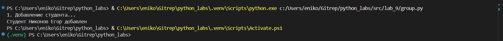
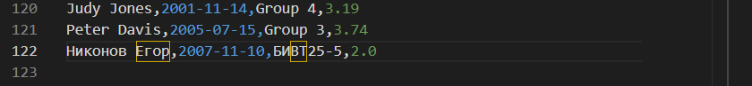

# Получение всех студентов
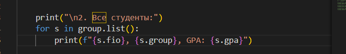
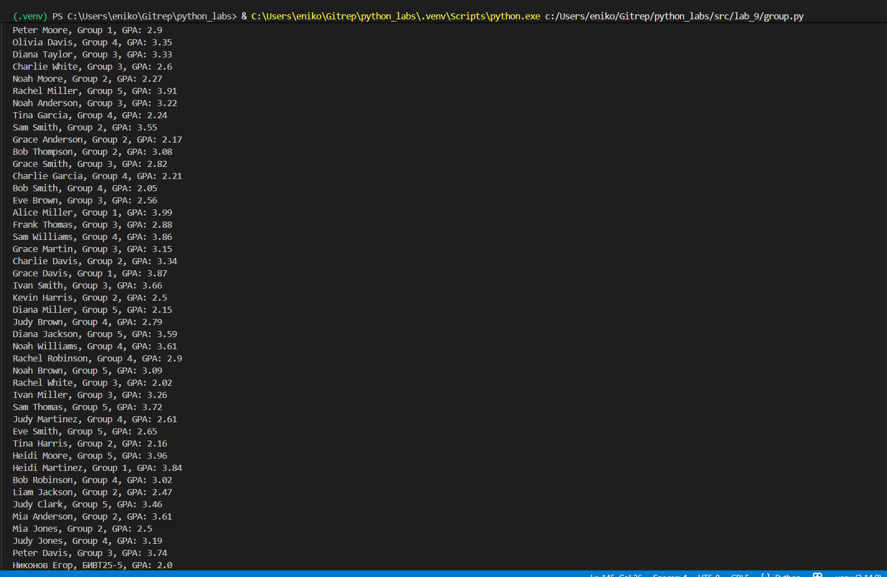

# Поиск студентов

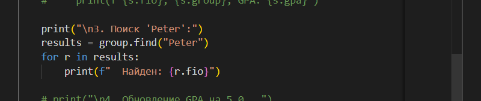
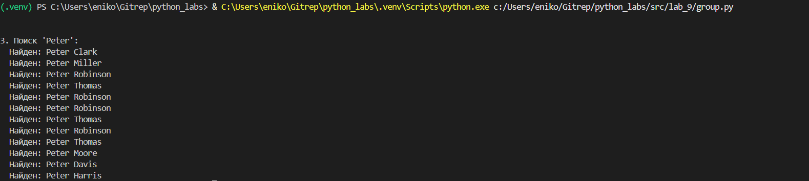

# Обновление данных

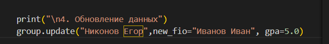
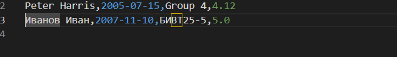

# Удаление студента
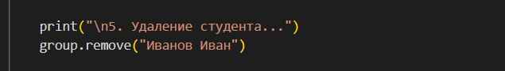
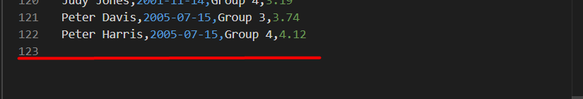

# Получение статистики
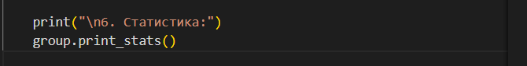
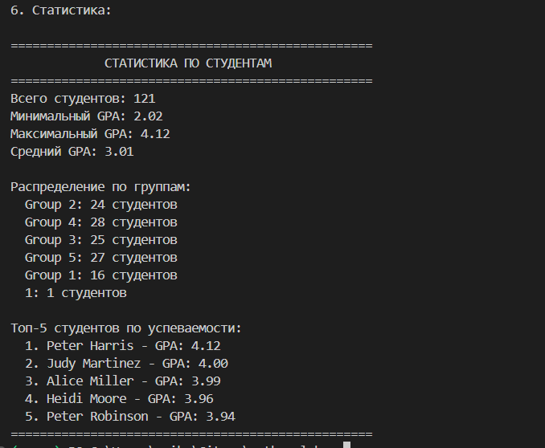